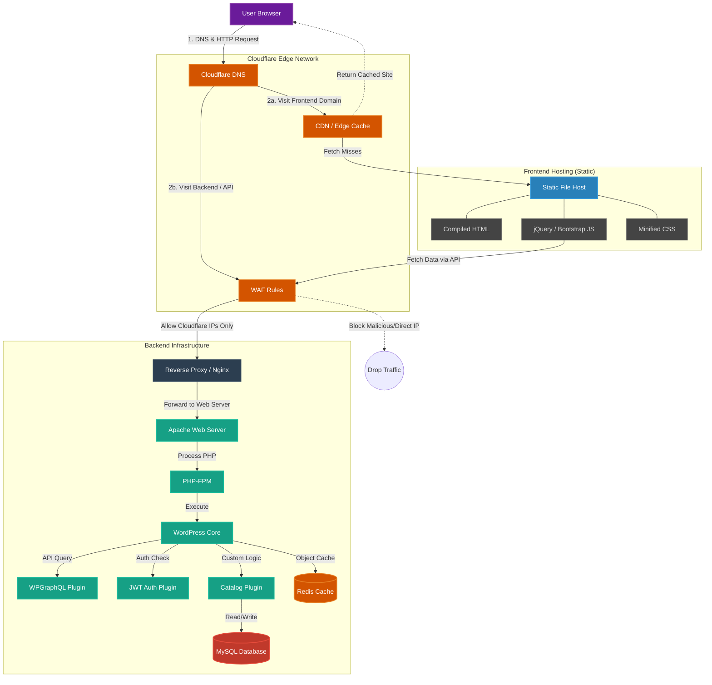

# Headless WordPress Catalog App

A full‑stack "Catalog" application leveraging a headless WordPress architecture. The app lists items with a custom display mapping that changes the frontend presentation dynamically. It features a clean, polished, mobile-first UI with robust server-side data control.

**Live Demo:** [https://fgscatalog.netlify.app/](https://fgscatalog.netlify.app/)

## Stack Choice and Architecture Decisions
- **Architecture**: A Headless CMS approach was chosen using WordPress. The backend acts strictly as a data provider via GraphQL, while the custom frontend queries and renders this data independently. This separation provides security, flexibility, and a streamlined developer experience.
- **Backend (WordPress)**: WordPress provides a familiar interface for managing content. By using `WPGraphQL`, we turn WordPress into a flexible API. Added plugins (`WPGraphQL Subscriptions` for real-time capabilities, and `WPGraphQL JWT Authentication` for secure sessions) ensure the API is robust and secure.
- **Database / Cache**: MySQL 8 is used for the database, and Redis (via `WP_REDIS_HOST`) handles object caching, enhancing performance for GraphQL queries by reducing direct DB hits.
- **Frontend**: Built with jQuery, Bootstrap CSS, and Gulp. This stack was chosen for direct styling and lightweight DOM manipulation without the overhead of heavy SPA frameworks. Gulp automates the asset pipeline (Sass compilation, concatenation, and minification).

## How to Run Locally
1. **Prerequisites**: Ensure you have Docker, Docker Compose, and Node.js installed.
2. **Start Backend Services**:
   - Navigate to the project root and run `docker-compose up -d`.
   - This spins up WordPress (`localhost:8080`), MySQL, phpMyAdmin (`localhost:8081`), and Redis. The setup includes an automated WP-CLI container (`catalog_wpcli`) that seeds the database and installs necessary configurations.
3. **Start the Frontend**:
   - Navigate to the `frontend/` directory.
   - Run `npm install` to install dependencies.
   - Run `npm run dev` (which executes `gulp watch`) to compile Sass and start BrowserSync. You can view the frontend on the local server endpoint provided by BrowserSync.

## WordPress Plugins Installation

### Automatic Installation (Docker)
The `docker-compose.yaml` file includes a `wpcli` container that automatically handles plugin activation and database seeding on first run. To manually trigger plugin activation via Docker:
```bash
docker exec -it catalog_wpcli wp plugin activate catalog wp-graphql wp-graphql-subscriptions wp-graphql-jwt-authentication --allow-root
```

### Manual Installation (Non-Docker)
If you are running WordPress on a standard LAMP/LEMP stack:
1. **Download & Install**:
   - [WPGraphQL](https://wordpress.org/plugins/wp-graphql/) (via WP Dashboard)
   - [WPGraphQL Subscriptions](https://github.com/wp-graphql/wp-graphql-subscriptions) (Download .zip and upload)
   - [WPGraphQL JWT Authentication](https://github.com/wp-graphql/wp-graphql-jwt-authentication) (Download .zip and upload)
2. **Custom Plugin**:
   - Copy the `wordpress_backend/plugins/catalog` folder into your `wp-content/plugins/` directory.
3. **Activation**:
   - Navigate to the **Plugins** menu in the WordPress Admin dashboard and activate all four plugins.
4. **JWT Config**:
   - Add `define('GRAPHQL_JWT_AUTH_SECRET_KEY', 'your-secret-token');` to your `wp-config.php`.

## How to Deploy
- **Backend Deployment**:
  - Provision a server with Docker or use a managed WordPress host. If using Docker, use the `docker-compose.yaml` as a base, adapt network settings, change default passwords, and set a robust `GRAPHQL_JWT_AUTH_SECRET_KEY` value.
  - Apply the `.htaccess` rules on an Apache server to strictly lock down `/wp-admin` to your deployment IP, and route all non-API or non-upload traffic to the frontend domain.
- **Frontend Deployment**:
  - Navigate to `frontend/` and run `npm run build` to generate production-ready static assets in the `dist/` folder.
  - Host these static files on a CDN or static hosting provider (e.g., Vercel, Netlify, AWS S3) or standard web hosting.
  - Update the `.htaccess` file's `RewriteRule ^(.*)$ http://localhost:8080[R=301,L]` statement (the `#fgs-production-note`) to point to your actual deployed frontend production domain.

## Data Model and API Routes Overview
- **Data Source**: WordPress acts as the single source of truth, but rather than REST, it exposes a single consolidated GraphQL endpoint at `/graphql`.
- **Custom Data Model**:
  - The core of the app revolves around **1 custom post type** for the catalog items.
  - The GraphQL schema exposes a custom `display mapping`, enabling the frontend to determine how to visually present the items.
- **Visibility and Card Sets**:
  - Catalog items are divided into two main groups: **Set A** and **Set B**.
  - **Unauthenticated Users**: Querying `/graphql` returns only Set A.
  - **Authenticated Users**: Supplying a JWT token in the request header gives access to both Sets A and B.
  - **Server-Side Pricing**: Item pricing is formulated dynamically on the server via `wp-graphql` based on the user's audience (logged-in vs. guest). It is explicitly delivered over the API response to avoid vulnerable client-side manipulation.

## Accessibility and Inclusion
The application is built with a strong focus on accessibility to ensure a great experience for all users:
- **Color Contrast**: All UI elements meet WCAG 2.2 AA standards for readability and visual clarity.
- **Semantic Landmarks**: Proper use of `<header>`, `<main>`, `<nav>`, and `<footer>` for clear document structure.
- **ARIA Usage**: Enhanced screen reader support with descriptive `aria-label`, and role attributes.
- **Skip to Main Content**: A functional "Skip to main content" link for keyboard users.
- **Focus Visibility**: Clearly defined focus states for all interactive elements to support keyboard navigation.
- **Semantic Roles**: Use of appropriate HTML5 elements and roles to convey meaning and functionality to assistive technologies.

## What I'd do next
- **Migrate Frontend to a Component-Based Framework**: Transition from jQuery/Gulp to React/Next.js or Vue/Nuxt.js. I could use React with Next.js but i have like 2 years i am not working with React and probably you will ask me for complex and experienced questions and jQuery is the best solution for me to answer or implement quick improves based on my experience with this framework.
- **Implement Automated Tests**: Add End-to-End tests (via Cypress or Playwright) to automatically verify that unauthenticated users absolutely cannot access Set B or specific pricing tiers.
- **Replace Apache Rewrite Rules with a Reverse Proxy**: Utilize Nginx or Traefik at the infrastructure level with Docker. Let the proxy manage routing to `/graphql`, IP restriction for `/wp-admin`, and static asset delivery without relying heavily on `.htaccess` modifications.
- **CI/CD Integration**: Establish automated GitHub Actions pipelines to build the Gulp assets and deploy to a static host while deploying backend/plugin updates separately.
- **Security and Cloudflare**: Add Cloudflare WAF rules to protect the backend and frontend from malicious attacks. Add an extra layer of security by configuring a WAF rule to only allow necessary paths. 
  
  **Recommended Cloudflare WAF Expression:**
  ```text
  (http.host eq "catalog.nilbug.com" and not http.request.uri.path starts_with "/graphql" and not http.request.uri.path starts_with "/wp-admin" and not http.request.uri.path starts_with "/wp-login.php" and not http.request.uri.path starts_with "/wp-includes" and not http.request.uri.path starts_with "/wp-content")
  ```
  *Note: Configure this rule to "Block" to prevent unauthorized access to sensitive WordPress files while keeping the API and admin accessible.*

    *Note 2: If possible allow only the server ip address as the only ip that can access the backend and the admin panel. Also allow only the frontend server to connect to the backend.*

---
## Project Request & Requirements

### Overview
Build and deploy a small full‑stack "Catalog" app. This is a WordPress headless CMS that has a free tier for developers. The app lists items and supports a custom "display mapping" that changes the frontend presentation. The UI should be clean, polished, and good-looking.

### Project Structure (Directory Tree)
```text
/
├── docker-compose.yaml       # Defines WordPress, MySQL, phpMyAdmin, and Redis
├── readme.md                 # Project documentation
├── frontend/                 # Custom UI built with jQuery and Bootstrap
│   ├── gulpfile.js           # Build tool configuration (Sass compilation, minification)
│   ├── package.json          # Node dependencies
│   ├── src/                  # Source files (SCSS, JS, HTML)
│   └── dist/                 # Compiled, production-ready assets
└── wordpress_backend/        # Headless CMS Backend setup
    ├── .htaccess             # Security rules (IP lockdown & redirection)
    └── plugins/
        └── catalog/
            ├── catalog.php      # Main custom plugin logic (CPT, GraphQL adjustments)
            └── seed-catalog.php # WP-CLI Script to populate initial DB data
```

### Backend & WordPress Settings
- **Plugins**: 
  - [WPGraphQL](https://wordpress.org/plugins/wp-graphql/)
  - [WPGraphQL Subscriptions](https://github.com/wp-graphql/wp-graphql-subscriptions)
  - [WPGraphQL JWT Authentication](https://github.com/wp-graphql/wp-graphql-jwt-authentication)
- **Data Model**: 1 custom post type implemented via the custom plugin.

### Frontend Details
- **Tech Stack**: jQuery, Bootstrap CSS, Gulp.
- **Design & Quality**:
  - Clean, good-looking UI: Clear layout, readable typography, consistent spacing, and a coherent visual style. The catalog should feel polished and intentional.
  - Responsiveness: Mobile‑first; works well from 360px up to desktop, including tablet.

### Development Environment
- **Docker Compose**: 4 containers (`wordpress`, `mysql`, `phpmyadmin`, and `redis` for cache).
- **Core File**: `docker-compose.yaml`
- **Config Needed**: `define( 'GRAPHQL_JWT_AUTH_SECRET_KEY', 'your-secret-token' );`

### Business Logic Requirements

#### Card Sets and Visibility
- **2 sets of cards**: Set A and Set B.
- **Not logged in**: show Set A only.
- **Logged in**: show Sets A and B.
- **Dynamic Pricing**: Must be determined server-side (`wp-graphql`). The correct price for the current audience must appear in the server-rendered output or initial API response, not only applied in the client.

#### Security & Server Rules
Only expose what is needed via Apache `.htaccess`:
```apache
<IfModule mod_rewrite.c>
RewriteEngine On

# 1. Open the door for GraphQL
RewriteCond %{REQUEST_URI} ^/graphql [NC]
RewriteRule ^ - [L]

# 2. Open the door for Media Uploads
RewriteCond %{REQUEST_URI} ^/wp-content/uploads/ [NC]
RewriteRule ^ - [L]

# 3. Keep the Admin Dashboard open ONLY for your IP address
# REPLACE 123.45.67.89 with your real IP address!
# RewriteCond %{REQUEST_URI} ^/wp-admin [NC,OR]
# RewriteCond %{REQUEST_URI} ^/wp-login\.php [NC]
# RewriteCond %{REMOTE_ADDR} !=123.45.67.89
# RewriteRule ^ - [F]

# 4. Redirect all other visitors to your new frontend website
RewriteCond %{REQUEST_URI} !^/graphql [NC]
RewriteCond %{REQUEST_URI} !^/wp-content/uploads/ [NC]
RewriteCond %{REQUEST_URI} !^/wp-admin [NC]
RewriteCond %{REQUEST_URI} !^/wp-login\.php [NC]
RewriteRule ^(.*)$ http://localhost:8080[R=301,L] # Hey!!! Web must be changed for production #fgs-production-note (tag for myself xD)

</IfModule>
```

#### Diagram



